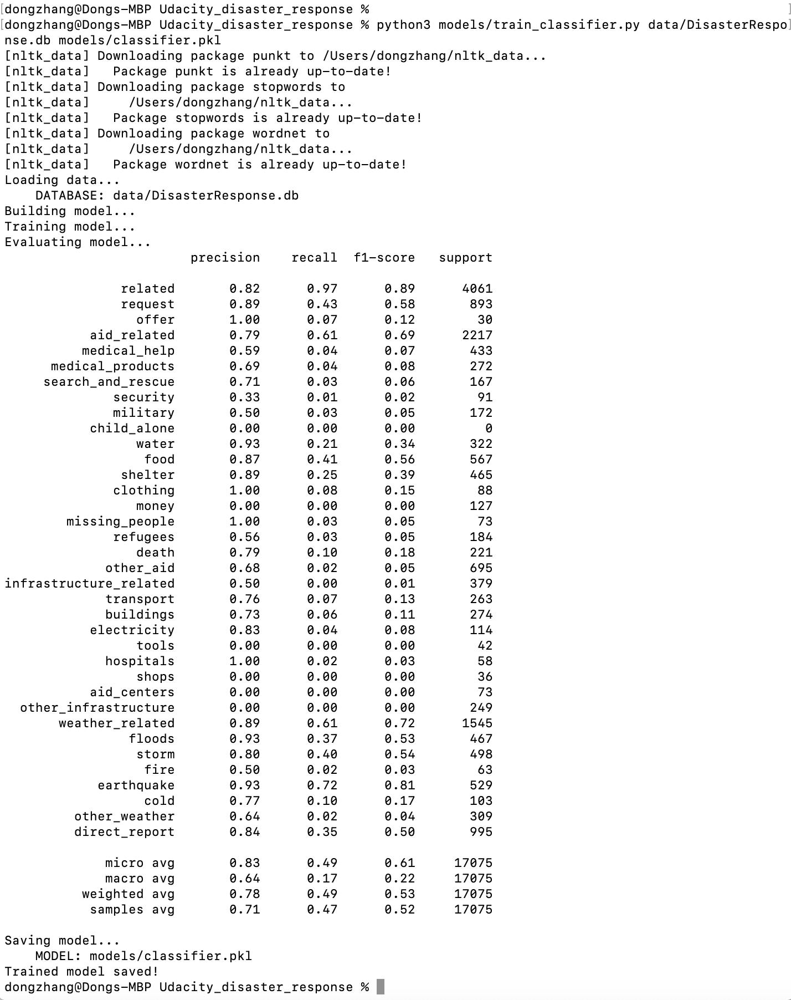
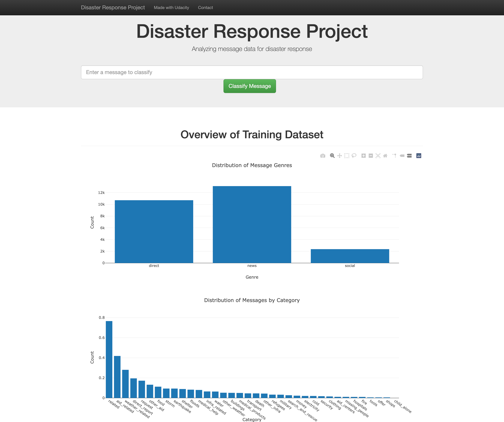
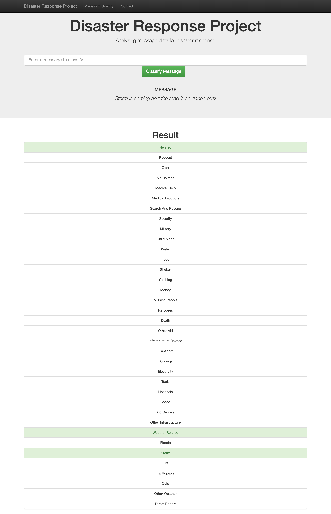

# Disaster Response Pipeline Project

### Description:

In this project I built machine learning classification model to categorize messages to better understand disaster responses. I first built an ETL pipeline to extract data from messages and categories data, cleaned the data and saved to a SQLite database. Next I used Natural Language Processing (NLP) methods to build the machine learning model to classify messages in many categories. Then I built a web application using Flask python. 

### Installation

In addition to python libraries numpy, pandas, matplotlib and seaborn, the following libraries are needed:

- sqlalchemy
- sklearn
- pickle
- nltk

download nltk packages 
- punkt
- stopwords
- wordnet

Also web application and data visualization tools:

- Flask
- plotly

### Files in the repository

1. **data**:

- disaster_categories.csv and disaster_messages.csv: datasets with all categories and messages
- process_data.py: ETL pipeline to load, clean and save processed data into a SQL database
- DisasterResponse.db: the saved result as a SQLite database.

2. **models**:

- train_classifier.py: machine learning classification pipeline to train the model, test the model accuracy, and save the model as a pickle file
- classifier.pkl: output model as a pickle file

3. **app**:

- run.py: Flask python to run the web application locally, with two figures
- templates: html files support the web application

### Instructions:
1. Run the following commands in the project's root directory to set up the database and model.

    - To run ETL pipeline that cleans data and stores in database
        `python data/process_data.py data/disaster_messages.csv data/disaster_categories.csv data/DisasterResponse.db`
    - To run ML pipeline that trains classifier and saves
        `python models/train_classifier.py data/DisasterResponse.db models/classifier.pkl`

2. Run the following command in the app's directory to run the web app.
    `python run.py`

3. Go to http://0.0.0.0:3001/

### Results

Running train_classifier.py in terminal:

The main webpage of the web application is

Two examples of message classification:

The first example

The second example

